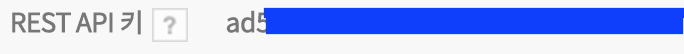
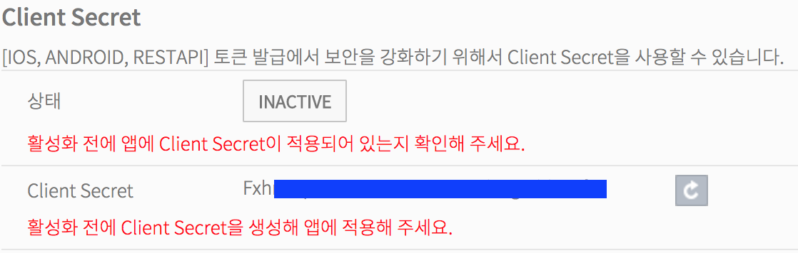
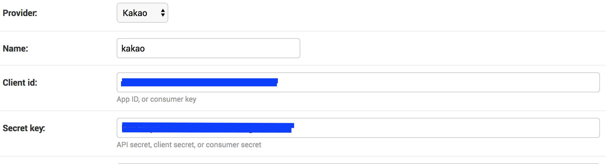

# Django-allauth

### 구현 기능

1. ##### 각 `allauth provider`를 이용하여 기본 로그인까지만 구현한다.


### 카카오 로그인

1. #### `Pip install Django-allauth`

2. #### https://developers.kakao.com 에 접속하여 앱 등록

3. #### Rest-api key를 `Django-admin` `SocialApplication`등록에서 client-id로 저장

   ##### 

4. #### Secret-key 저장

   ##### 

   

5. #### Accounts 앱 추가

6. #### settings.py

   ```Python
   # thirdparty_apps
   'allauth',
   'allauth.account',
   'allauth.socialaccount',
   'allauth.socialaccount.providers.kakao',
   # local_apps
   'accounts',
   ```

7. #### 프로젝트/urls.py

   1. ##### `allauth url`에는 `namespace`를 지정하지 않는다.

   ```Python
   from django.conf.urls import url, include
   from django.contrib import admin

   urlpatterns = [
       url(r'^admin/', admin.site.urls),
       url(r'^accounts/', include('accounts.urls', namespace='accounts')),
       url(r'^accounts/', include('allauth.urls')),
   ]
   ```

8. #### Accounts/urls.py

   1. ##### 로그아웃은 내장 `auth_views`의 로그아웃을 이용

   ```Python
   from django.conf.urls import url, include
   from django.contrib import admin
   from accounts import views
   from django.contrib.auth import views as auth_views

   urlpatterns = [
       url(r'^login/$', views.login, name='login'),
       url(r'^profile/$', views.profile, name='profile'),
       url(r'^logout/$', auth_views.logout, name='logout', kwargs={'next_page': 'cast:index'}),
   ]
   ```

9. #### accounts/views.py

   ```Python
   from django.contrib.auth.views import login as auth_login
   from allauth.socialaccount.models import SocialApp
   from allauth.socialaccount.templatetags.socialaccount import get_providers
   from django.contrib.auth.decorators import login_required
   from django.conf import settings
   from django.shortcuts import render


   def login(request):
       providers = []
       for provider in get_providers(): # settings/INSTALLED_APPS 내에서 활성화된 목록
       # social_app속성은 provider에는 없는 속성입니다.
           try:
               # 실제 Provider별 Client id/secret 이 등록이 되어있는가?
               provider.social_app = SocialApp.objects.get(provider=provider.id, sites=settings.SITE_ID)
           except SocialApp.DoesNotExist:
               provider.social_app = None
           providers.append(provider)

       return auth_login(request,
           #authentication_form=LoginForm,
           template_name='accounts/login_form.html',
           extra_context={'providers': providers})


   @login_required
   def profile(request):
    return render(request, 'accounts/profile.html')
   ```

10. #### Accounts/templates/accounts/login_form.html 추가

    

    ```html
    

    
        <li class={{provider.name}}>
            
                <a href="" class={{provider.name}}>
                    <strong>{{ provider.name }} 로그인 </strong>
                </a>
            
                <a>
                    Provider {{ provider.name }} 설정이 필요합니다.
                </a>
            
        </li>
    
    ```

    

11. #### Accounts/templates/accounts/profile.html 추가

    

    ```html
    
    <div class="profile_info">{{ user.socialaccount_set.first.extra_data.kaccount_email }}</div>
    ```

    
